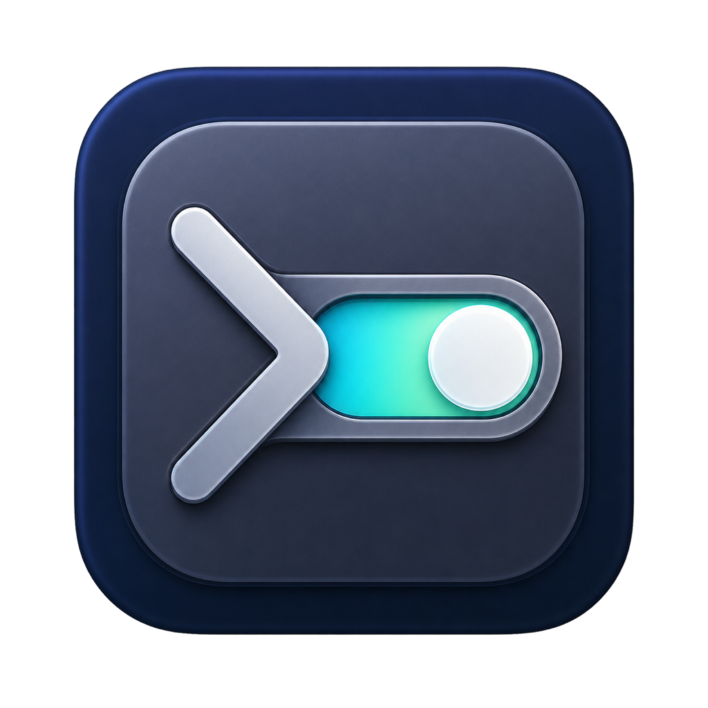

# AI Shell Switch

<p align="center">
  
</p>

MacBookの蓋を閉じている間もローカルAI処理を継続させるための、macOSメニューバーアプリとCLIです。

**配布ページ:** [AI Shell Switchをダウンロード](https://trustdrivensystem.com/labs/ai-shell-switch/)

**ソースコード:** [sheer-jp/ai-shell-switch](https://github.com/sheer-jp/ai-shell-switch)

> [!CAUTION]
> ONはmacOSのスリープを無効化します。必ず電源アダプタを接続し、Macをバッグや布の中に入れず、作業後はOFFへ戻してください。

## 必要環境

- macOS 13以降
- Xcode Command Line Tools（`swiftc`）
- 電源アダプタ（ON時）

## インストール

配布ページの「ソースZIPをダウンロード」から取得するか、Gitでcloneします。

```sh
git clone https://github.com/sheer-jp/ai-shell-switch.git
cd ai-shell-switch
./install.sh
```

`~/Applications/AI Shell Switch.app` をインストールして起動し、同じCLI本体への短縮コマンドを `~/.local/bin` に作成します。アプリアイコンを開くと、現在状態とON/OFFボタンを持つ操作画面が表示されます。`~/.local/bin` がPATHにない環境では、追加方法をインストーラーが表示します。

ビルド用アプリは通常表示されない `.build/` に置かれ、インストール完了後に削除されます。FinderやLaunchpadで利用するアプリは `~/Applications` の1個だけです。

## 最初に1回だけ行う設定

切り替えのたびにパスワードを入力したくない場合は、次を1回実行します。

```sh
ai-setup
```

macOSの管理者確認はこの時だけ表示されます。許可される管理者操作は次の2コマンドだけです。

```text
/usr/bin/pmset -a disablesleep 0
/usr/bin/pmset -a disablesleep 1
```

解除する場合は `ai-unsetup` を実行します。設定しない場合も、ON/OFF時にmacOSの管理者確認を使う方式で動作します。

## コマンド

```sh
ai-on       # AI稼働モードをON（AC電源接続時だけ）
ai-off      # 普通のmacOSスリープへ戻す
ai-toggle   # ON/OFFを切り替える
ai-status   # 現在の状態と電源を表示
ai-doctor   # 設定を変更せず診断
```

すべての操作は統合コマンドでも利用できます。

```sh
ai-shell-switch on
ai-shell-switch off
ai-shell-switch toggle
ai-shell-switch status
ai-shell-switch setup
ai-shell-switch unsetup
ai-shell-switch doctor
```

コマンドが見つからない場合は、新しいターミナルを開いて `ai-doctor` を実行してください。それでも見つからない場合は `./install.sh` を再実行します。

## メニューバーとショートカット

画面上部の表示をクリックして切り替えます。

- `AI ON`: 蓋を閉じてもスリープしない設定
- `AI OFF`: 普通のmacOSスリープ設定
- `AI ON ⚠︎`: ONのままバッテリー駆動になっている警告

全体ショートカットは `Control + Option + A`（`⌃⌥A`）です。OFF中は操作画面を開くだけで、キーの誤入力だけではONになりません。ON中は安全のため、同じキーですぐOFFへ戻せます。Caps LockはmacOSで通常の修飾キーとして扱われず、文字入力中の誤操作も起きやすいため使用していません。

初回起動時にユーザー用のログイン起動へ登録します。メニューの `ログイン時にも起動` からいつでも解除できます。

## アプリアイコンから開く

FinderまたはLaunchpadで `AI Shell Switch` のアイコンをクリックすると、操作画面が前面に開きます。

- 常駐中で画面を閉じている場合: 同じ操作画面をもう一度開きます。
- 常駐が終了している場合: アプリを起動し直して操作画面を開きます。
- ログイン時の自動起動: 画面を勝手に出さず、メニューバーへ静かに常駐します。

操作画面を閉じてもメニューバー常駐は続きます。完全に止める場合は、メニューバーの `終了` を選びます。

## 診断

```sh
ai-doctor
```

次を変更せずに確認します。

- `pmset` と実際のON/OFF状態
- AC／バッテリー電源
- インストール済みアプリとバージョン
- パスワード省略設定
- CLIのPATH

## 開発とテスト

```sh
./test.sh
./build.sh
```

`build.sh` は `Assets/AppIcon.png` からmacOS標準の `sips` と `iconutil` で `AppIcon.icns` を生成し、`.build/AI Shell Switch.app` を構築します。アプリ内の `Contents/Resources/ai-shell-switch` にはCLIも同梱します。`test.sh` はShellCheck、shfmt、Swift typecheck、モック化したON/OFF・ACガード・権限設定、アイコンの全サイズ、plist、署名、sudoers契約を検証します。テストは実機の電源設定を変更しません。

テストを実行する開発環境では `shellcheck`、`shfmt`、`jq` も必要です。

## 技術的な境界

- このスイッチはAIタスク自体を起動・停止・再開するものではありません。
- `pmset disablesleep` の挙動はMacの機種、macOS、電源、外部ディスプレイ、温度条件に左右されます。
- OFF時は `SleepDisabled=0` に戻し、通常のmacOSスリープ動作を使います。
- ONはAC電源接続時だけ許可します。OFFはいつでも実行できます。
- 通気を確保し、バッグや布の中ではONにしないでください。

## License

[MIT License](LICENSE)
